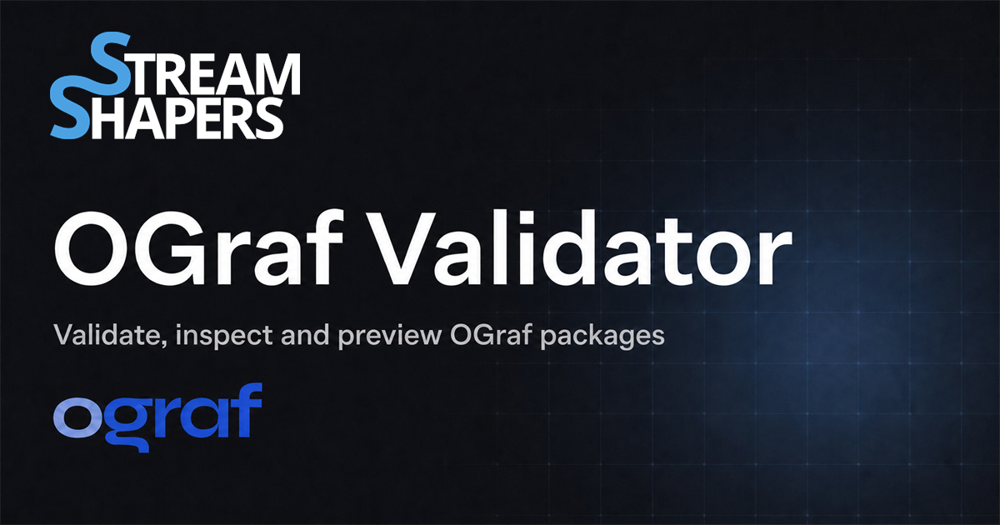

# OGraf Validator

[](https://validator.streamshapers.com)
[](https://www.npmjs.com/package/@streamshapers/ograf-validator-core)
[](https://ograf.ebu.io/v1/specification/docs/Specification.html)
[](LICENSE)



OGraf Validator checks, inspects, and previews
[OGraf Graphics Packages](https://ograf.ebu.io/v1/specification/docs/Specification.html)
in the browser. It is an open-source
[StreamShapers](https://streamshapers.com) community tool for broadcast
graphics developers.

> Package files stay on your computer. The validator has no backend and does
> not upload your files.

**[Open the validator](https://validator.streamshapers.com)** ·
**[View the core package on npm](https://www.npmjs.com/package/@streamshapers/ograf-validator-core)** ·
**[Report an issue](https://github.com/Richardpwe/OGraf-Validator/issues)**

## Use the validator

1. Open the [hosted validator](https://validator.streamshapers.com) in a current
   version of Chrome or Edge.
2. Select a folder that contains one or more `*.ograf.json` manifests.
3. Static validation and runtime checks start automatically.
4. Select a Graphic to inspect its manifest, data schema, assets, and preview.

The validator reports three kinds of results:

- **Errors** mean the manifest, package, or Graphic API is not OGraf compliant.
- **Warnings** point to problems that should be reviewed but may still allow the
  package to run.
- **Inconclusive checks** mean the isolated browser preview could not test a
  feature reliably. They are not reported as OGraf errors.

## Features

- Validates the official OGraf v1 manifest and GDD schemas.
- Checks normative rules that are described in the specification but are not
  fully covered by its JSON schemas.
- Checks local entry files, thumbnails, custom-action schemas, and nested file
  references.
- Supports `actionDurations`, `thumbnails`, render requirement alternatives,
  engine declarations, and public internet requirements.
- Inspects recursive GDD schemas, `hidden`, `order`, `select`, and typed
  `select-multiple` fields.
- Finds every `*.ograf.json` manifest, including several manifests that share
  one asset folder.
- Runs automatic realtime and non-realtime API checks for statically valid
  Graphics.
- Shows clear package readiness states for static and runtime results.
- Provides an interactive preview with editable GDD data and action controls.

## Safe local preview

Graphic code runs in a temporary iframe with `sandbox="allow-scripts"`. It does
not receive same-origin access and cannot read the validator DOM or its origin
storage.

Each load and reload gets a new session. Package paths are normalized and
checked before a file is read. Sessions, tabs, and module graphs do not share
package resources.

The preview supports local ESM imports, CSS imports and `url(...)` assets,
`srcset`, media range requests, and module or classic Dedicated Workers.
Unsupported dynamic Worker entries and `SharedWorker` are shown as inconclusive
preview limits instead of OGraf errors.

A Service Worker is used when it is available. It is not required for runtime
checks: the validator falls back to its isolated MessageChannel file bridge if
the Service Worker cannot register or does not control the page.

External thumbnail URLs are not loaded automatically.

## Browser support

Use a current Chromium-based browser:

- Google Chrome
- Microsoft Edge
- Chromium

The directory picker uses the File System Access API. Firefox and Safari are
not supported at this time. The hosted validator uses HTTPS, which is required
for browser file and sandbox features.

## Validator core

The validation library can also be used in Node.js or browser projects. It has
no runtime dependencies.

```bash
npm install @streamshapers/ograf-validator-core
```

```ts
import {
    validateManifest,
    validatePackage,
} from '@streamshapers/ograf-validator-core';

const manifestResult = validateManifest(manifest);

const packageResult = await validatePackage(
    manifest,
    fs,
    'lower-third.ograf.json', // optional manifest filename
);
```

File access is provided by the host through `VirtualFS`:

```ts
interface VirtualFS {
    readFile(path: string): Promise<string>;
    fileExists(path: string): Promise<boolean>;
    listFiles(path?: string): Promise<string[]>;
    getFileSize?(path: string): Promise<number>;
}
```

Both validators accept `unknown` input. Invalid data and file-system failures
are returned as validation issues instead of being thrown. The package does not
provide a CLI or `bin` command.

## OGraf specification version

Validation uses a local snapshot of the stable OGraf Graphics v1 specification:

- EBU commit [`d42afced`](https://github.com/ebu/ograf/commit/d42afcedf9348e05e35b2009b04fb9552785e35b)
- Snapshot date: 7 August 2026
- Local files: [`packages/validator-core/spec/ebu-ograf-v1-d42afced`](packages/validator-core/spec/ebu-ograf-v1-d42afced)

The app never downloads schemas at runtime. Spec updates are reviewed and added
manually. `npm run spec:check` verifies the stored hashes and generated
standalone validator.

## Local development

Requirements:

- Node.js 20.19 or newer
- npm 10 or newer
- Google Chrome for Playwright tests

```bash
npm install
npm run dev          # http://localhost:3000
npm test             # app and core unit tests
npm run typecheck
npm run lint
npm run build
npm run spec:check
npm run smoke:core   # pack and install the real npm tarball
npm run test:e2e
```

Run the complete release gate with:

```bash
npm ci
npm run release:check
```

The release check runs linting, type checking, unit tests, the spec snapshot
check, production builds, the installed-package smoke test, Playwright tests,
and full dependency audits.

## Repository layout

```text
ograf-validator/
├── packages/
│   ├── app/              # React and Vite browser app
│   └── validator-core/   # TypeScript validation library and spec snapshot
├── fixtures/             # Static and runtime test packages
├── scripts/              # Package smoke checks
├── CHANGELOG.md          # Changelog index
└── LICENSE
```

## Changelogs

The app and core library are versioned separately:

- [OGraf Validator app changelog](packages/app/CHANGELOG.md)
- [Validator core changelog](packages/validator-core/CHANGELOG.md)

## Contributing

Issues and pull requests are welcome. Use Conventional Commits and keep `.js`
extensions on relative ESM imports, including imports written in TypeScript.

## License

[MIT](LICENSE) © [StreamShapers](https://streamshapers.com)
