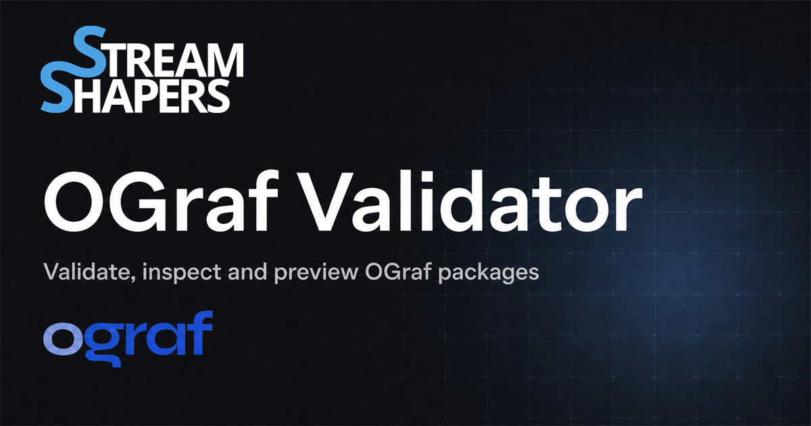

# OGraf Validator

[](https://validator.streamshapers.com)
[](https://github.com/Streamshapers/OGraf-Validator/actions/workflows/ci.yml)
[](https://www.npmjs.com/package/@streamshapers/ograf-validator-core)
[](https://ograf.ebu.io/v1/specification/docs/Specification.html)
[](LICENSE)



OGraf Validator checks, inspects, and previews
[OGraf Graphics Packages](https://ograf.ebu.io/v1/specification/docs/Specification.html)
in the browser. It is an open-source
[StreamShapers](https://streamshapers.com) community tool for broadcast
graphics developers.

> Package files stay on your computer. The validator has no backend and does
> not upload your files.

**[Open the validator](https://validator.streamshapers.com)** ·
**[View the core package on npm](https://www.npmjs.com/package/@streamshapers/ograf-validator-core)** ·
**[Report an issue](https://github.com/Streamshapers/OGraf-Validator/issues)**

## Use the validator

1. Open the [hosted validator](https://validator.streamshapers.com) in a current
   version of Chrome or Edge.
2. Select a folder, choose **Open ZIP**, or drop a ZIP containing one or more
   `*.ograf.json` manifests onto the app.
3. Static validation and runtime checks start automatically.
4. Select a Graphic to inspect its manifest, data schema, assets, and preview.

ZIP files are read locally into a read-only snapshot for the current tab. Nothing
is extracted to your disk or uploaded. Multiple manifests and shared relative
assets work like folder imports; the configured scan depth still applies. Reopen
the ZIP after changing it. It does not replace your saved last folder.

ZIP import supports unencrypted stored or Deflate-compressed entries with UTF-8
or ASCII filenames, up to 50 MiB compressed, 100 MiB expanded, 2,000 entries and
20 path levels. ZIP64, split archives, symbolic links, unsafe or conflicting
paths, and corrupt contents are rejected. Cancellation or a rejected archive
keeps the currently opened project available.

**Test coverage** separates standard and extended results, showing check counts,
confirmed step indices, Custom Actions and the render configurations actually
sent to Load. Unrun checks and missing evidence remain explicit. A successful
call does not verify the visual output or establish coverage of other profiles.
JSON and HTML reports include the same coverage data.

The validator reports three kinds of results:

- **Errors** identify a manifest, package, or Graphic API violation, or an observed
  execution failure. The diagnostic explains which was detected; an exception
  alone does not establish a specific OGraf contract violation.
- **Warnings** point to problems that should be reviewed but may still allow the
  package to run.
- **Inconclusive checks** mean the isolated browser preview could not test a
  feature reliably. They are not reported as OGraf errors.

Automatic runtime checks use manifest defaults. If required input is missing,
invalid, exceeds the test-data generator's limits, or uses schema assertions the
input checker cannot evaluate, the affected calls are not executed and readiness
is **Needs Review**. Test suitable
input manually in Preview, or correct the defaults for the next automatic run.
Explicitly parameterless custom actions (`schema: null`) are executed; actions
without a usable schema or payload remain visible as untested. Runtime results
cover the observed test cycle, including cleanup, rather than all possible inputs
or future asynchronous behavior.

Use **Run extended tests** in the Validation tab to check additional step targets,
relative navigation, repeated use with animations enabled, and NRT timeline seeking.
It uses the same validated manifest defaults as the standard test. Automatic tests
on opening or changing files remain standard tests.

Extended tests run in the background when you select another Graphic. The global
activity indicator offers **Cancel**. The default total budget is two minutes;
after a timeout, you can restart with five or ten minutes. Each independent
scenario starts in a fresh sandbox, and every retry starts the complete suite again.

Extended failures affect package readiness. Cancelled, timed-out, or partially
covered runs are inconclusive, and known failures remain visible until a complete,
conclusive retry replaces them. Changing package files clears results for the old
version. Known step counts above 20 use a representative set of 20 targets and
report the omitted coverage. Dynamic step models receive up to three consecutive
contract checks without requiring an artificial end. Successful calls do not prove
visual correctness or animation duration.

JSON reports retain standard results in `runtimeTest` and add extended results in
`extendedRuntimeTest`; HTML reports include both suites and their coverage.
Matching contract failures appear once under **Runtime findings**, with their
observations from both suites in expandable details. Test sections link to those
shared findings. Issue counts exclude coverage notes about checks that could not
run; incomplete coverage remains visible and continues to affect readiness.
JSON also includes `runtimeFindings` while preserving the individual test results.

Reports include app/core versions, the pinned EBU commit, browser user agent,
run timestamps, package fingerprints, and captured invocation parameters and raw
responses. The load invocation records the actual render configuration and test
data; schedules and subsequent calls retain their own parameters. Missing or
bounded evidence is explicitly marked rather than reconstructed from current files.
Before either download, **Review report contents** shows the included data and
allows cancellation. Defaults and Graphic responses may contain names, URLs or
other private values; package source files are not embedded and no upload occurs.

`reportFormatVersion: 1` identifies this report format. Invocation evidence uses
`type: json`, `type: undefined`, or `type: unavailable`; `undefinedPaths` identifies
nested undefined values represented by null placeholders in the JSON view.
The package fingerprint is SHA-256 over the UTF-8 JSON serialization of sorted
`[relativePath, byteLength, fileSha256]` tuples. Paths use JavaScript's default string
sort order. It covers the package directory using the validator's file scope,
including shared local resources and excluding ignored directories. External
resources are not included. Capture is limited to 2,000 files, 100 MiB and five
seconds per snapshot. Individual evidence values are bounded to 100,000 characters,
20,000 nodes and 50 levels; exceeding these limits does not change validation results.
Before/after comparisons are not atomic filesystem snapshots. The separate
export-time fingerprint must not be mistaken for the tested package's fingerprint.
Reports support manual reproduction with the matching package; importing a report
and automatically replaying scenarios remains a future extension.

Runtime findings show **Expected / Received** for known API contract failures.
Expand **Show calls and scenarios** to inspect each observation's actual inputs and
response. Exceptions retain their recorded context without inferred expectations.
Static issues offer **Show in manifest** when the diagnostic path identifies a unique
field; missing fields link to their existing parent. Ambiguous paths are not linked.
JavaScript source-line navigation is not offered without a verified mapping to the
original package file.

Diagnostics include method-specific guidance and specification references in the
UI and exported JSON/HTML reports. The pinned specification is unchanged by
diagnostic corrections. Where the official prose, examples, and informative
TypeScript definitions disagree, existing compatibility is preserved (including
`dispose()` resolving to `undefined`, the `result` field, and `currentStep:
undefined` at the end).

## Features

- Validates the official OGraf v1 manifest and GDD schemas.
- Checks normative rules that are described in the specification but are not
  fully covered by its JSON schemas.
- Checks local entry files, thumbnails, custom-action schemas, and nested file
  references.
- Supports `actionDurations`, `thumbnails`, render requirement alternatives,
  engine declarations, and public internet requirements.
- Inspects recursive GDD schemas, `hidden`, `order`, `select`, and typed
  `select-multiple` fields.
- Finds every `*.ograf.json` manifest, including several manifests that share
  one asset folder.
- Runs automatic realtime and non-realtime API checks for statically valid
  Graphics.
- Offers optional extended checks for steps, repeated lifecycles, and NRT seeking.
- Shows clear package readiness states for static and runtime results.
- Provides an interactive preview with editable GDD data and action controls.

## Safe local preview

Graphic code runs in a temporary iframe with `sandbox="allow-scripts"`. It does
not receive same-origin access and cannot read the validator DOM or its origin
storage.

Each load and reload gets a new session. Package paths are normalized and
checked before a file is read. Sessions, tabs, and module graphs do not share
package resources.

The preview supports local ESM imports, CSS imports and `url(...)` assets,
`srcset`, media range requests, and module or classic Dedicated Workers.
Unsupported dynamic Worker entries and `SharedWorker` are shown as inconclusive
preview limits instead of OGraf errors.

A Service Worker is used when it is available. It is not required for runtime
checks: the validator falls back to its isolated MessageChannel file bridge if
the Service Worker cannot register or does not control the page.

External thumbnail URLs are not loaded automatically.

## Browser support

Use a current Chromium-based browser:

- Google Chrome
- Microsoft Edge
- Chromium

The directory picker uses the File System Access API. Firefox and Safari are
not supported at this time. The hosted validator uses HTTPS, which is required
for browser file and sandbox features.

## Validator core

The validation library can also be used in Node.js or browser projects. It has
no runtime dependencies.

```bash
npm install @streamshapers/ograf-validator-core
```

```ts
import {
    validateManifest,
    validatePackage,
} from '@streamshapers/ograf-validator-core';

const manifestResult = validateManifest(manifest);

const packageResult = await validatePackage(
    manifest,
    fs,
    'lower-third.ograf.json', // optional manifest filename
);
```

File access is provided by the host through `VirtualFS`:

```ts
interface VirtualFS {
    readFile(path: string): Promise<string>;
    fileExists(path: string): Promise<boolean>;
    listFiles(path?: string): Promise<string[]>;
    getFileSize?(path: string): Promise<number>;
}
```

Both validators accept `unknown` input. Invalid data and file-system failures
are returned as validation issues instead of being thrown. The package does not
provide a CLI or `bin` command.

## OGraf specification version

Validation uses a local snapshot of the stable OGraf Graphics v1 specification:

- EBU commit [`8a74757b`](https://github.com/ebu/ograf/commit/8a74757bc4919fd898db1f562b14ad18fe22bc77)
- Snapshot date: 22 September 2026
- Local files: [`packages/validator-core/spec/ebu-ograf-v1-8a74757b`](packages/validator-core/spec/ebu-ograf-v1-8a74757b)

The app never downloads schemas at runtime. Spec updates are reviewed and added
manually. `npm run spec:check` verifies that the documented EBU commit,
snapshot metadata, stored hashes, and generated standalone validator agree.
It works offline and does not check whether EBU has published newer sources.

`npm run spec:check:upstream` runs the local check first, then compares the pinned
sources with a fixed resolution of EBU `main`. It reports `current` (exit 0),
`changed` (exit 1), or `unavailable` (exit 2). A local integrity failure exits 1
before any network request. New commits affecting only the website or Server API
do not require a Graphics snapshot update. Changed sources require review; the
command never replaces files or infers new normative requirements.

The independent **EBU specification freshness** GitHub workflow runs on the
default branch every Monday at 07:23 UTC and can also be started manually.
Changes and unavailable checks fail that workflow without blocking normal PR
or release checks. See [CONTRIBUTING.md](CONTRIBUTING.md#specification-changes)
for the reviewed update process.

## Local development

Requirements:

- Node.js 24 or newer
- npm 11.5.1 or newer
- Google Chrome for Playwright tests

The repository runs `tsc` with TypeScript 7. ESLint uses the compatible
TypeScript 6 compiler API through a separate package alias. `smoke:toolchain`
checks both parts before the release gate continues.

```bash
npm install
npm run dev          # http://localhost:3000
npm test             # app and core unit tests
npm run typecheck
npm run lint
npm run build
npm run spec:check
npm run spec:check:upstream # optional online freshness check
npm run smoke:toolchain # verify the TypeScript 7 compiler and TypeScript 6 API
npm run smoke:core   # pack and install the real npm tarball
npm run test:e2e     # build dist and test it in Chrome
```

Run the complete release gate with:

```bash
npm ci
npm run release:check
```

The release check runs linting, type checking, unit tests, the spec snapshot
check, production builds, the installed-package smoke test, Playwright tests,
and full dependency audits.

## Repository layout

```text
ograf-validator/
├── packages/
│   ├── app/              # React and Vite browser app
│   └── validator-core/   # TypeScript validation library and spec snapshot
├── fixtures/             # Static and runtime test packages
├── scripts/              # Package smoke checks
├── CHANGELOG.md          # Changelog index
└── LICENSE
```

## Changelogs

The app and core library are versioned separately:

- [OGraf Validator app changelog](packages/app/CHANGELOG.md)
- [Validator core changelog](packages/validator-core/CHANGELOG.md)
- [Release process and tag conventions](RELEASING.md)

## Contributing

Issues and pull requests are welcome. Read the
[contribution guide](CONTRIBUTING.md) before starting a change. Use
[private vulnerability reporting](SECURITY.md) for security problems.

## License

[MIT](LICENSE) © [StreamShapers](https://streamshapers.com)
